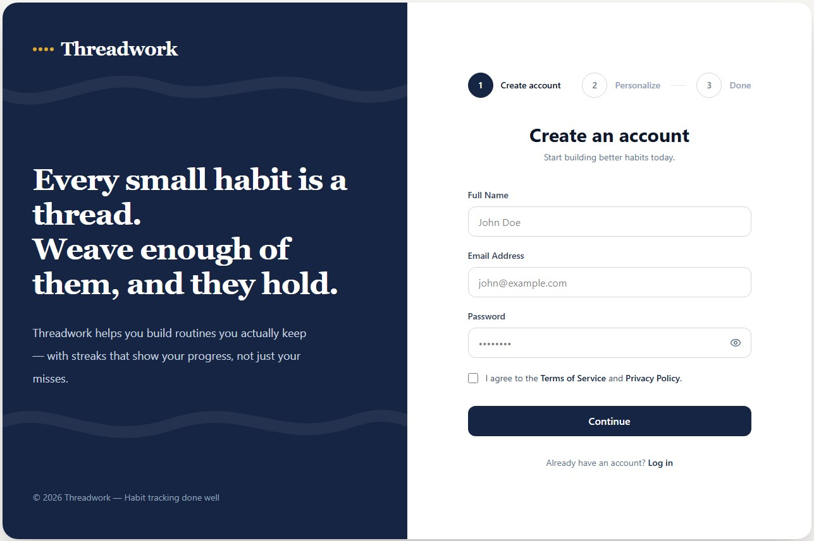
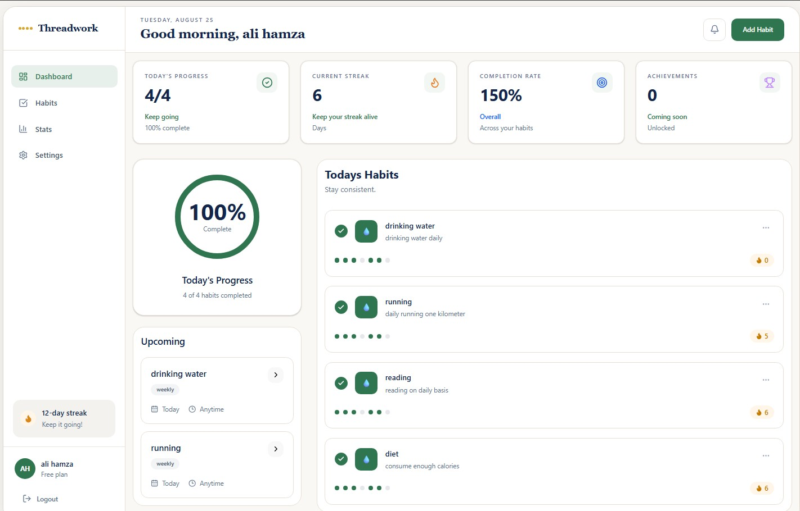
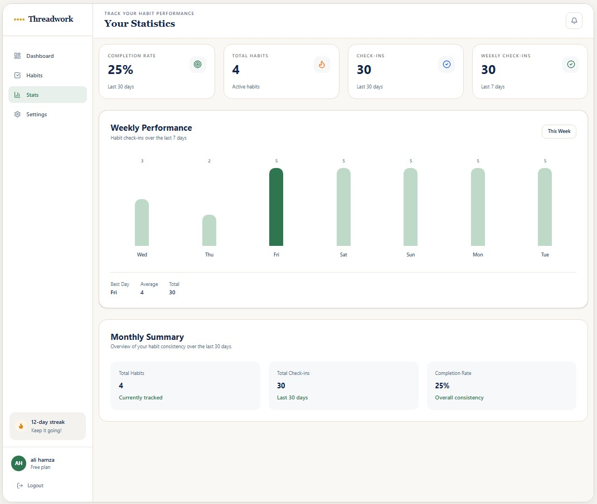
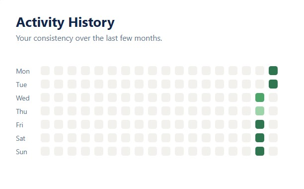
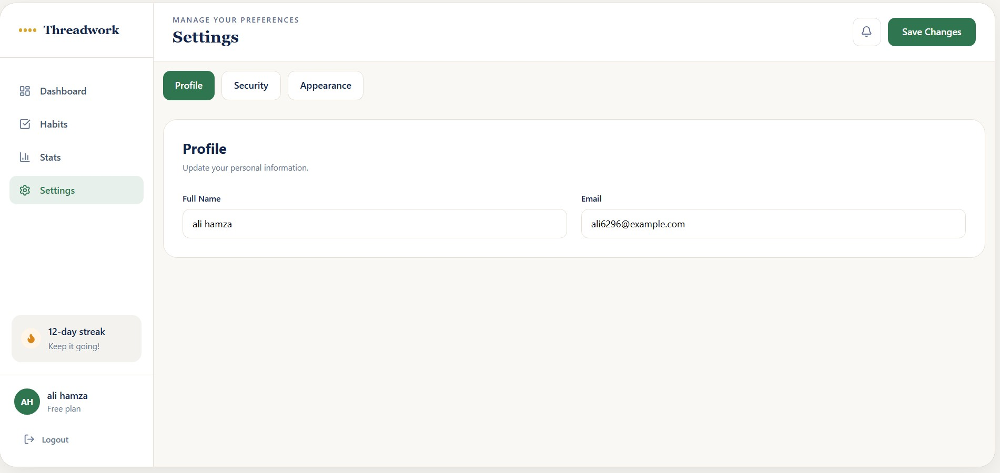

# Threadwork — Habit Tracker

> A full-stack habit tracking application built to make consistency visible.

Threadwork helps users build better habits through daily check-ins, streak tracking, activity heatmaps, and progress analytics.

<p align="center">
  
</p>

<p align="center">
  <a href="https://habit-tracker-frontend-gamma-seven.vercel.app">
    <strong>Live Demo</strong>
  </a>
  &nbsp;&nbsp;•&nbsp;&nbsp;
  <a href="https://habit-tracker-3nnx.onrender.com">
    <strong>Backend API</strong>
  </a>
</p>

---

## Preview

### Dashboard

<p align="center">
  
</p>

The dashboard gives users a quick overview of their habits, completion status, streaks, and daily progress.

---

### Habit Details & Streaks

<p align="center">
  
</p>

Each habit has its own statistics including:

- Current streak
- Longest streak
- Total check-ins
- Completion rate
- Activity history

---

### Activity Heatmap

<p align="center">
  
</p>

The GitHub-style activity heatmap turns daily habit activity into a visual history, making consistency easy to understand at a glance.

---

### Settings

<p align="center">
  
</p>

Users can manage their profile, notifications, reminders, appearance preferences, and account settings.

---

# Features

## Authentication

- User registration
- Secure login
- JWT-based authentication
- Protected routes
- Persistent authentication
- User profile
- Password hashing with bcrypt
- Change password
- Automatic authentication redirects

## Habit Management

- Create habits
- Edit habits
- Delete habits
- Archive habits
- Daily habits
- Weekly habits
- Custom schedules
- Weekday-based scheduling
- Monthly scheduling
- Habit descriptions

## Daily Check-ins

- Mark habits as completed
- Undo check-ins
- Prevent duplicate check-ins
- Track check-in history
- Habit-specific activity

## Streak System

- Current streak
- Longest streak
- Total check-ins
- Completion rate
- Automatic streak calculation
- Visual streak indicators

## Analytics

- Weekly analytics
- Monthly analytics
- Yearly analytics
- Daily activity
- Completion percentage
- Total check-ins
- GitHub-style activity heatmap

## Settings

- Update profile
- Change password
- Notification preferences
- Daily reminders
- Weekly reports
- Appearance preferences

## Responsive UI

Designed for:

- Desktop
- Laptop
- Tablet
- Mobile

---

# Tech Stack

### Frontend

- Next.js
- React
- TypeScript
- Tailwind CSS
- Lucide React
- clsx

### Backend

- NestJS
- TypeScript
- MongoDB
- Mongoose
- Passport
- JWT
- bcrypt
- class-validator

### Deployment

- Vercel
- Render
- MongoDB

---

# Architecture

```text
                         THREADWORK
                             │
                             ▼
                  ┌─────────────────────┐
                  │      Next.js        │
                  │      Frontend       │
                  │                     │
                  │  Dashboard          │
                  │  Habits             │
                  │  Analytics          │
                  │  Settings           │
                  └──────────┬──────────┘
                             │
                             │ REST API
                             │ JWT
                             ▼
                  ┌─────────────────────┐
                  │       NestJS        │
                  │       Backend       │
                  │                     │
                  │  Authentication     │
                  │  Habits             │
                  │  Check-ins          │
                  │  Streaks            │
                  │  Analytics          │
                  └──────────┬──────────┘
                             │
                             │ Mongoose
                             ▼
                  ┌─────────────────────┐
                  │      MongoDB        │
                  │                     │
                  │  Users              │
                  │  Habits             │
                  │  Check-ins          │
                  └─────────────────────┘
